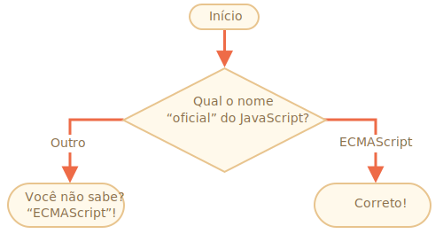

importância: 2

---

# O nome do JavaScript

Usando a função `if..else`, escreva um código que pergunte:  'Qual o nome "oficial" do JavaScript?'

Se o visitante responder "ECMAScript", a saída será "Correto!",  caso contrário -- saída: "Vocẽ não sabe? ECMAScript!"

[demo src="ifelse_task2"]

